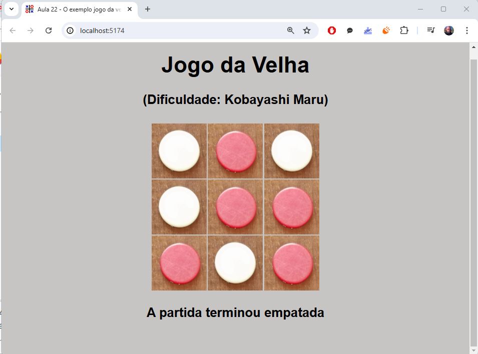

# Aula 22 - O exemplo jogo da velha - código 1 - React essencial e acelerado

## Introdução
> Esta videoaula é a quinta de uma série de oito aulas, voltada a apresentar o desenvolvimento de uma aplicação do mundo real, um jogo da velha, fazendo uso dos conhecimentos das aulas anteriores. O presente vídeo é o primeiro (de três) que trata a implementação da aplicação. Corresponde ao conteúdo da seção 7.5 do capítulo 7 do livro 'React essencial e acelerado'.
[Professor Ricardo Pereira e Silva - Descrição Aula 22](https://www.youtube.com/watch?v=1rp27bprtQw&list=PLQb3t1uw-rpFCJlfyglJkJ_8Zz_gMIa7A&index=22&ab_channel=ModelagemOrientadaaObjetoscomUML)

# Aula 24 - O exemplo jogo da velha - código 3 - React essencial e acelerado
> Esta videoaula é a sétima de uma série de oito aulas, voltada a apresentar o desenvolvimento de uma aplicação do mundo real, um jogo da velha, fazendo uso dos conhecimentos das aulas anteriores. O presente vídeo é o terceiro (de três) que trata a implementação da aplicação. Corresponde ao conteúdo da seção 7.5 do capítulo 7 do livro 'React essencial e acelerado'.
[Professor Ricardo Pereira e Silva - Descrição Aula 24](https://www.youtube.com/watch?v=7obIdrXjEVQ&ab_channel=ModelagemOrientadaaObjetoscomUML)

## Tela do App

## Adaptações
Alterações, melhorias e complementos adicionados que não estão presentes na videoaula nem no repositório do professor.
- Icone jogo-velha.svg
- Diretorio Documents/
    - Diagrama Jogo-Velha-Componentes.svg

## Links
- [Video-aulas React essencial e acelerado](https://www.youtube.com/watch?v=Wdto4xO981g&list=PLQb3t1uw-rpFCJlfyglJkJ_8Zz_gMIa7A&index=1&ab_channel=ModelagemOrientadaaObjetoscomUML);
- [Livro React essencial e acelerado](https://www.amazon.com.br/React-essencial-acelerado-Ricardo-Pereira-ebook/dp/B0CS4MT24K/ref=sr_1_1?crid=KYMXD3Y1SRYA&keywords=react+essencial+e+acelerado&qid=1705929956&sprefix=react+essen%2Caps%2C191&sr=8-1);
